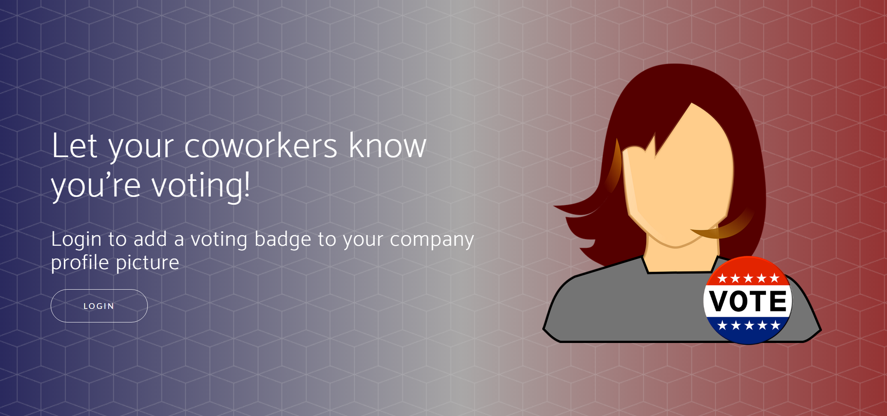

# Profile Badge Graph Sample

This sample lets users update their pictures with a temporary badge.  The badge is currently themed for the 2016 election and users add a "I voted!" badge to the pictures, but that can easily be substituted for other events.  It uses the graph to get and set the photo and also to find top user contacts.

* Users can place a badge with drag, drop, and multitouch scaling.
* Users can change their photo to any image they upload (important for when they want to revert back!)
* After they change their photo, the graph finds their key contacts and suggests that they invite them to try the app.
* If users go straight to [server]/login-to-revert-photo, they'll be prompted to upload a photo to replace their badge photo.



## Prerequisites

To use the Profile Badge Graph Sample, you need the following:

 * [Node.js](https://nodejs.org/) version 4 or 5.
 * Either a [Microsoft account](https://www.outlook.com/) or a [work or school account](http://dev.office.com/devprogram)
 * Certificates placed in ./utils/cert/server.key and ./utils/cert/server.crt

## Register the application

1. Sign into the [App Registration Portal](https://apps.dev.microsoft.com/) using either your personal or work or school account.

2. Choose **Add an app**.

3. Enter a name for the app, and choose **Create application**. 
	
   The registration page displays, listing the properties of your app.

4. Copy the Application Id. This is the unique identifier for your app. 

5. Under **Application Secrets**, choose **Generate New Password**. Copy the password from the **New password generated** dialog.

   You'll use the application ID and password (secret) to configure the sample app in the next section. 

6. Under **Platforms**, choose **Add Platform**.

7. Choose **Web**.

8. Enter *https://localhost:8443/token* as the Redirect URI. 

9. Choose **Save**.

## Build and run the sample

1. Download or clone the Profile Badge Graph Sample.

2. Using your favorite IDE, create **config.js** in */utils* from **config.example.js**.

3. Replace the **clientId** and **clientSecret** placeholder values with the application ID and password that you copied during app registration.

4. In a command prompt, run the following command in the root directory of the starter project. This installs the project dependencies.

  ```npm install```

5. Run the following command to start the development server.

  ```node app.js```

6. Navigate to `https://localhost:8443/` in your web browser.

## Questions and comments

We'd love to get your feedback about the Profile Badge Graph Sample. You can send your questions and suggestions in the [Issues](https://github.com/microsoftgraph/nodejs-connect-sample/issues) section of this repository.

Questions about Microsoft Graph development in general should be posted to [Stack Overflow](http://stackoverflow.com/questions/tagged/microsoftgraph). Make sure that your questions or comments are tagged with [microsoftgraph].

## Contributing

If you'd like to contribute to this sample, see [CONTRIBUTING.MD](/CONTRIBUTING.md).

This project has adopted the [Microsoft Open Source Code of Conduct](https://opensource.microsoft.com/codeofconduct/). For more information see the [Code of Conduct FAQ](https://opensource.microsoft.com/codeofconduct/faq/) or contact [opencode@microsoft.com](mailto:opencode@microsoft.com) with any additional questions or comments.
  
## Additional resources

- [Microsoft Graph JavaScript SDK](https://github.com/microsoftgraph/msgraph-sdk-javascript)
- [Other Microsoft Graph Connect samples](https://github.com/MicrosoftGraph?utf8=%E2%9C%93&query=-Connect)
- [Microsoft Graph](http://graph.microsoft.io)

## Resource attribution

-[Start Bootstrap - New Age theme](https://github.com/BlackrockDigital/startbootstrap-new-age)
-[Voting badge](https://pixabay.com/en/vote-button-election-elect-1319435/)
-[Avatar](https://pixabay.com/en/woman-redhead-female-person-girl-995164/)

## Copyright
Copyright (c) 2016 Microsoft. All rights reserved.